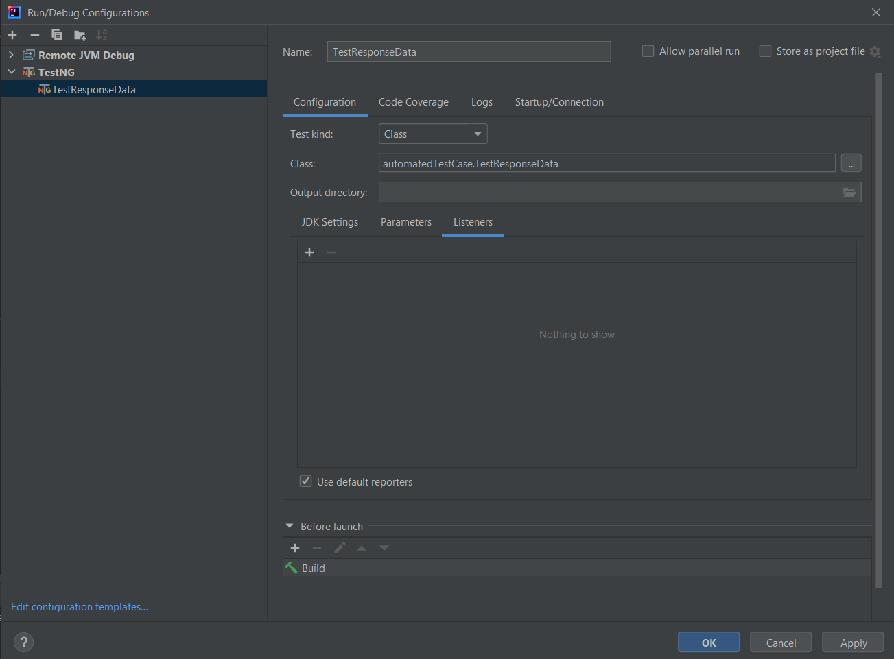
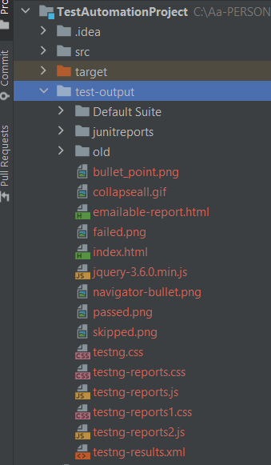

"# TestAutomationAssurity"
This project allows you to run an automated test project written using java using the IntelliJ Idea.

## PRE REQUISITES

First we need to `install` the [IntelliJ idea IDE](https://www.jetbrains.com/idea/download/#section=windows])
You need the [java JDK](https://www.oracle.com/java/technologies/downloads/) and [maven](https://maven.apache.org/download.cgi) installed.

## SET UP
checkout the [repository](https://github.com/sadelk/TestAutomationAssurity)
Launch the project in IDE. 

This project will use the following plug-ins written in java. Latest stable dependencies are specified in the pom.xml file.

**[REST Assured](https://rest-assured.io/)**, Testing and validating REST services in Java.

**[TestNG](https://testng.org/doc/)** as the testing framework.
To create the TestNG profile, go to Edit Configurations and add a new configuration for TestNG for the current project.
 Select the class name and under listeners check the default listeners unless specific required.

## RUN PROJECT
Use maven to clean, validate and install the project in order to download the necessary dependencies and build the project.
`maven clean install`

Run the project using maven and notice that the three acceptance criteria are checked in the project.
**Acceptance Criteria**:

    * Name = "Carbon credits"
    * CanRelist = true
    * The Promotions element with Name = "Gallery" has a Description that contains the text "Good position in category"

The result report will be generated in the test-output package under the main project with several formats to display the results.

emailable-report.html and index.html has a summary of the tests run and displayed in a readable manner.

